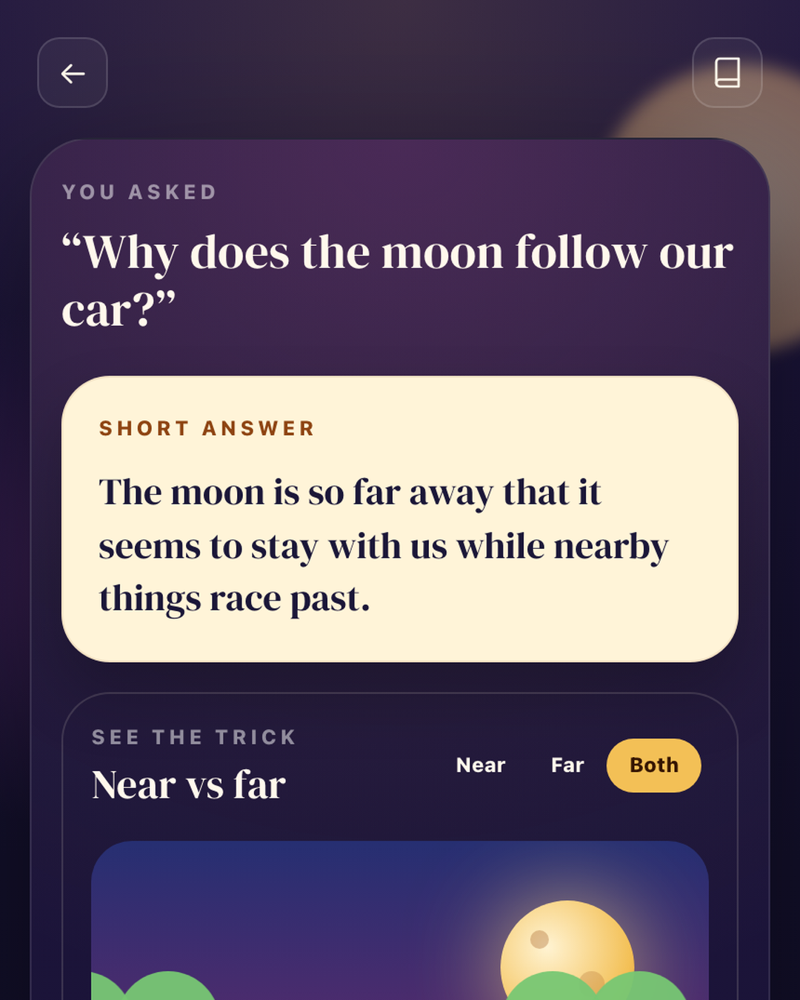

# Wonder Journal

Wonder Journal is a local-first curiosity journal for young kids. A parent or child asks a question, the app generates a factual child-friendly answer/story through a local Ollama model, and successful stories are saved to a local SQLite journal.



## What It Does

- Answers the child’s curiosity first with a short, simple explanation.
- Adds a visual clue or lightweight animation so the answer is easier to understand.
- Reads the answer aloud slowly using the browser voice engine.
- Offers a story answer when the child wants a more playful explanation.
- Saves generated answers locally in a private SQLite journal.
- Runs in dummy mode for UI testing or Ollama mode for local LLM generation.

## Quick Start

```bash
npm install
cp .env.example .env.local
npm run dev -- -H 0.0.0.0
```

Open the app at:

- Laptop: `http://127.0.0.1:3000`
- Phone on same Wi-Fi: `http://<your-laptop-ip>:3000`

## Dummy Mode

The app defaults to dummy mode so the full UI can be tested without Ollama:

```env
USE_DUMMY_STORIES=true
NEXT_PUBLIC_USE_DUMMY_STORIES=true
```

## Ollama Mode

Install Ollama on the laptop running the app, then:

```bash
ollama pull qwen3:4b
npm run check:ollama
npm run check:ollama:generate
```

Switch `.env.local` to:

```env
USE_DUMMY_STORIES=false
NEXT_PUBLIC_USE_DUMMY_STORIES=false
```

Restart the dev server after changing env vars.

More detailed setup notes live in `docs/personal-laptop-setup.md`.
